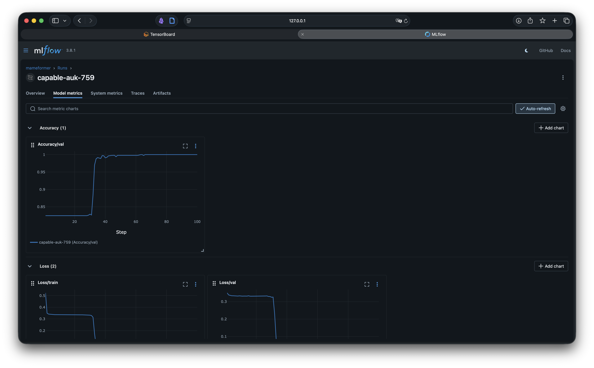

# MameFormer


Ultra small and simple Transformer Decoder implementation, now structured as an ML project with
Hydra/MLflow/Accelerate.

```sh
uv venv
uv pip sync pyproject.toml --torch-backend=auto
uv pip install torch --torch-backend=auto
```

## Training

Hydra manages all hyperparameters under `configs/`.

```sh
set -a; source .env.example; set +a; uv run python scripts/train.py
```

Accelerate for multi-GPU / mixed precision:

```sh
set -a; source .env.example; set +a; uv run accelerate launch scripts/train.py # training.num_epochs=100
```

## Inference / Evaluation

```sh
set -a; source .env.example; set +a; uv run python scripts/generate.py -c outputs/$MLFLOW_EXPERIMENT_NAME/checkpoints/checkpoint_epoch_100.pth --numbers 1,2,3,4,5,6,7,8,9,10,11,12,13
set -a; source .env.example; set +a; uv run python scripts/evaluate.py -c outputs/$MLFLOW_EXPERIMENT_NAME/checkpoints/checkpoint_epoch_100.pth --file data/test.txt
```

ONNX export:

```sh
set -a; source .env.example; set +a; uv run python scripts/generate.py -c outputs/$MLFLOW_EXPERIMENT_NAME/checkpoints/checkpoint_epoch_100.pth --export-onnx outputs/model.onnx
```

## MLflow + TensorBoard

Set `MLFLOW_TRACKING_URI` (and optionally `MLFLOW_EXPERIMENT_NAME`) or override via Hydra:

```sh
set -a; source .env.example; set +a; uv run python scripts/train.py experiment.mlflow.tracking_uri=http://127.0.0.1:5000
```


TensorBoard logs are stored in `outputs/{experiment_name}/tensorboard`.

```sh
set -a; source .env.example; set +a; uv run mlflow ui
```




## Data Generation

Numbers that are multiples of 3 or contain the digit ‘3’.

```sh
python -c "print('\n'.join(f'{n}A' if n%3==0 or '3' in str(n) else f'{n}Z' for n in range(1,50000)))" > data/3train.txt
python -c "print('\n'.join(f'{n}A' if n%3==0 or '3' in str(n) else f'{n}Z' for n in range(50000,100000)))" > data/3test.txt
```


Numbers that are multiples of 5 or contain the digit ‘5’.

```sh
python -c "print('\n'.join(f'{n}A' if n%5==0 or '5' in str(n) else f'{n}Z' for n in range(1,50000)))" > data/5train.txt
python -c "print('\n'.join(f'{n}A' if n%5==0 or '5' in str(n) else f'{n}Z' for n in range(50000,100000)))" > data/5test.txt
```

Numbers that are multiples of 7 or contain the digit ‘7’. Since there are few five-digit numbers that are multiples of 7, it’s better to increase the epochs, e.g `training.num_epochs=3000 data.train_path=data/7train.txt`.

```sh
python -c "print('\n'.join(f'{n}A' if n%7==0 or '7' in str(n) else f'{n}Z' for n in range(1,50000)))" > data/7train.txt
python -c "print('\n'.join(f'{n}A' if n%7==0 or '7' in str(n) else f'{n}Z' for n in range(50000,100000)))" > data/7test.txt
```
